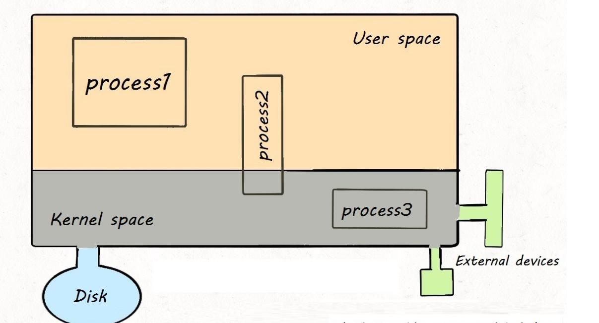
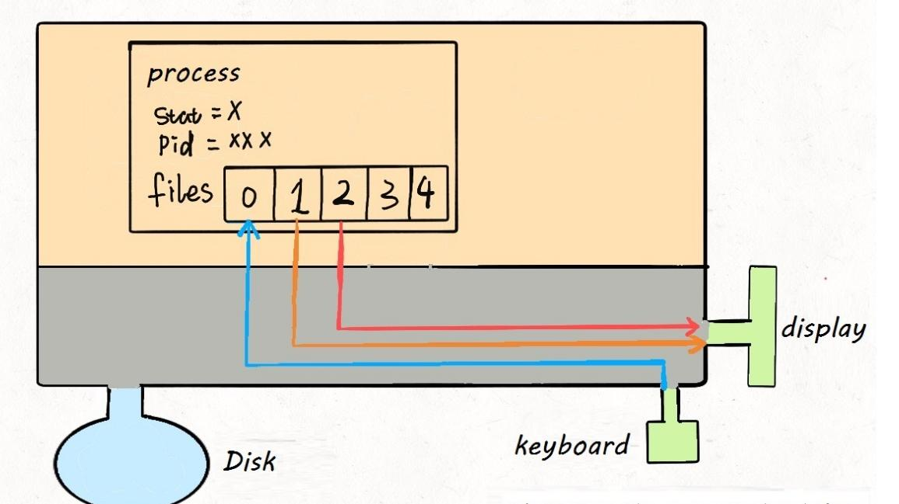

# What are Processes, Thread and File Descriptor in Linux

The most common problem of interview is the relationship between thread and process.
The answer is : **In Linux systems, there is almost no difference between process and thread**.

A process of Linux is a data structure. You can clearly understand the underlyingg working principle of
file descriptors, redirection and pipeline commands. Finally, from the perspective of 
operatin system, we can see why there is basically no differencee between thread and process.

## 1.What is a process

Fist, abstracly, our computer is this thing as follows:



This large rectangle represents the computer's **memory space**,where the small 
rectangle represents  **process**, this circle in the lower left corner represents
**disk** and the graph in the lower right corner represents some **input and output devices**
such as mouse, keyboard, monitor, etc. In addtion, it is noted that the memory space
is divided into two parts, the upper part represents **user space** and the lower
part represents **kernel space**.


User space holds the resources that the users process needs to use.For example,
if you create an array in the program, this array must exists in the user space.
Kernel space stores system resources that the kernel process needs to load. These 
resources are generally not allowed to be accessed by users. But some user process can share
some kernel space resources, such as some dynamic link libraries and so on.

We write a hello program in C language, comile it to get an executable file, run 
it on the command line to display Hello World on the screen, and then exit the 
program. At the operating system level, a new process is created, which read the executable
file into memory space, excutes it and finally exits.

** The executable program you compiled is just a file**, not a process. The executable file 
must be loaded into memory and packed into a process to really run. Processes are created 
by the operating system. Each process has its inherent attribuutes, such as process ID(PID),
process status, open files, etc. After the process is created, ti reads into your program
and your program will be executed by the system.

So, how does the operating system created processes? **For the operating system, 
a process is a data structure**. Let's look directly at the linux source code:

```cpp
struct task_struct {

 //Process status
    /* -1 unrunnable, 0 runnable, >0 stopped */
    long state;
    //Vurtual memory struct
    struct mm_struct **mm;
    pid__t pid;
    //Pointer to parent process
    struct task_struct __rcu *parent;
    // Children form the list of natural children
    struct list_head children;
    // Pointer to filesystem information
    struct fs_struct *fs;
    // Open file information
    struct files_struct *files;
};
```


`task_struct` is the description of a process by the Linux kernel, which can also
be called `process descriptors`. The [source code](https://github.com/torvalds/linux/blob/master/include/linux/sched.h).
So i only intercepted a few common lines here.

The interesting ones aare the `mm` pointer and the `files` pointer. The `mm` pointer
regers to the virtual memory of the process, which is where the resources and executable 
files are loaded. The `files` pointer points to an array cotaining pointers to all files
opened by the process.


## 2.What is a file descriptor

Let's start with `files`, which is an array of file pointers. Generally, a process will read 
input from `files[0]`, write output to `files[1]` and write error information to `files[2]`.

For example, from our perspective, the `printf` function in C is to print characters to the commamd line
but from the process perspective, it  is to write data to `files[1]`. SImilarly, 
the `scanf` function is that the process reads data from `files[0]`.

**When each process is created, the first three bits of `files` are filled with default values, which 
point to standard input stream, standard output stream and standard error stream. 
We often say `file descriptor` refers to the index of this file pointer array**.
So the file descriptor of the program by default : 0 represents stadard input(stdin), 
1 is standard output (stdout), 2 is standard error (stderr).



For general computers, input stream is the keyboard, output stream and error stream
are both displays. So now this process is connected to the kernel with three wires.
Because hardware resources are managed by the kernel, our process need to let kernel 
process to access hardware resources through **system calls**.

PS: Don't forget, everything is avstracted into files in Linux. And devices are also
files, which can be read and written.

If the program we wrote needs other resources, such as opening a file for reading 
and writting, this is also very simple. Make a system call and let the kernel open the file
and this file will be plaves in the 4th potion of `files`:


Understand this principle, **input redirection** is easy to understand. When the 
program wants to read data, it will read `files[0]`. So we just point `files[0]` to 
a file. Then the program will read the data from this file instead of keyboard. The 
**less-than character < ** is used to redirect the input of a commannd.

```shell
command < file.txt
```


Similarly, **output redirection** is to point `files[1]` to a file. So the output 
of the program will not be written to the display, but to this file. The **greater-than character > **
is used for output redirection.

```shell
command > file.txt
```


Error direction is the same.


*Pipe symbol**  is actually the same. It connects the output stream of one process of another
process and the data is passed in it. 

```shell
cmd1 | cmd2 | cmd3
```


At this point, you may also see the clever design idea of **Everything is a file in Linux**. 
Whether it is a device, a process, a socket or a real file. All of them can be read and written.
And they are loaded into simple `files` arrray. 


## 3. What is a thread


